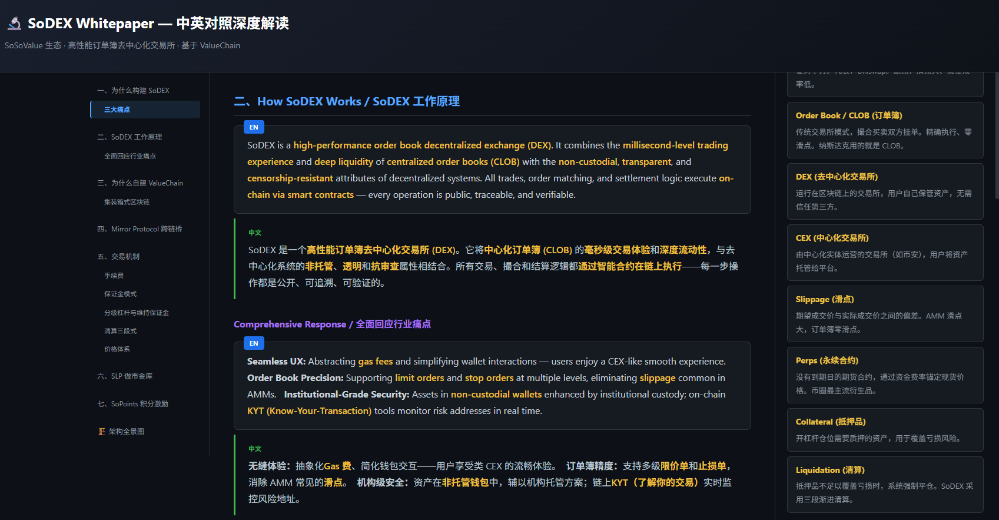
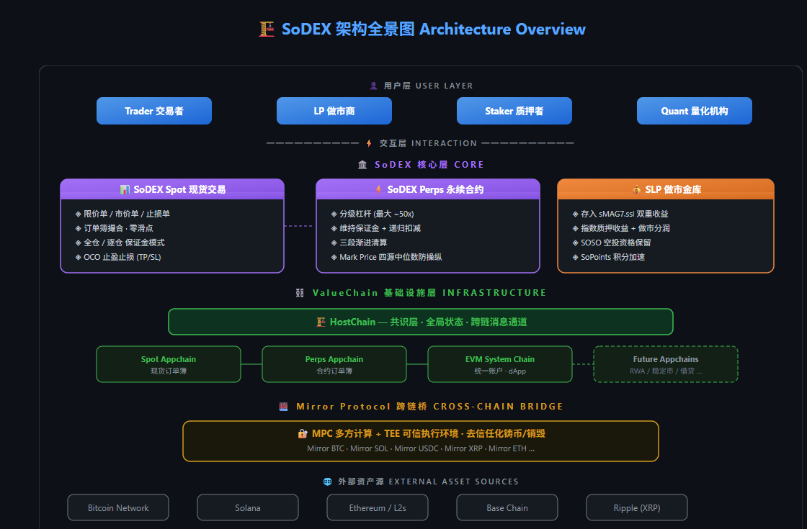

# Paper Fast Scan

> Turn any Web3 whitepaper into a beautifully structured, bilingual static HTML page — in minutes.



> *Full page with bilingual content, glossary sidebar, and navigation*



> *Architecture SVG diagram with liquidation flow*

## What is this?

A **[Hermes Agent](https://github.com/nousresearch/hermes-agent) skill** that:

1. **Fetches** a whitepaper or technical documentation from a URL
2. **Understands** the project's architecture, mechanics, and key concepts
3. **Generates** a self-contained HTML page with:
   - 📖 **Bilingual content** — Original English + your-language translation, side by side
   - 🟡 **Key terms highlighted** — AMM, CLOB, liquidation, mark price… all in yellow
   - 📑 **Sticky left navigation** — Scroll-spy TOC with smooth scrolling
   - 📚 **Right sidebar glossary** — Every technical term explained in plain language
   - 🧮 **Formula summary** — All math extracted and explained with worked examples
   - 🏗️ **Architecture SVG diagram** — Hand-crafted layered diagram at the bottom
   - 🌙 **Dark theme** — GitHub-dark inspired, easy on the eyes

## Quick Start

1. Install [Hermes Agent](https://hermes-agent.nousresearch.com/docs)
2. Copy this skill to `~/.hermes/skills/research/paper-fast-scan/`
3. Just say:

```
用 Paper-Fast-Scan 解析 https://example.com/whitepaper
```

The **target language is auto-detected** from your message. Write in Chinese → EN+CN page. Japanese → EN+JA. English → English-only digest with glossary.

## Example Output

Open [`examples/sodex-whitepaper.html`](examples/sodex-whitepaper.html) in your browser.

Generated from [SoDEX Documentation](https://sodex.com/documentation) — a high-performance order book DEX on its own L1 appchain.

## Supported Sources

| Platform | Support | Notes |
|----------|---------|-------|
| GitBook | ✅ | Auto-discovers sub-pages from TOC |
| ReadTheDocs | ✅ | Follows sidebar nav structure |
| Docusaurus | ✅ | Parses sidebar.json |
| Plain Markdown | ✅ | Any `.md` file or URL |
| PDF Whitepapers | ✅ | Via `pymupdf` / `marker-pdf` |

## File Structure

```
paper-fast-scan/
├── README.md                   ← You are here
├── LICENSE                     ← MIT
├── SKILL.md                    ← Full workflow for the AI agent
├── templates/
│   └── page.html               ← HTML template with {{PLACEHOLDER}} vars
├── examples/
│   └── sodex-whitepaper.html   ← Generated example (open in browser)
└── scripts/
    ├── fetch_gitbook.py         ← GitBook page crawler
    └── parse_pdf.py             ← PDF text extractor
```

## How It Works

```
URL → fetch pages → extract text → LLM comprehends → generates HTML
                                                      ├── bilingual content
                                                      ├── glossary sidebar
                                                      ├── formula boxes
                                                      ├── SVG architecture diagram
                                                      └── scroll-spy navigation + JS
```

The AI doesn't just translate — it **comprehends**. It identifies the problem, the architecture, the key Web3 concepts, and the formulas that matter. The output reads like a well-written study guide, not machine translation.

## Template Customization

The HTML template uses `{{PLACEHOLDER}}` variables:

| Placeholder | What it becomes |
|-------------|-----------------|
| `{{PROJECT}}` | Project name |
| `{{SUBTITLE}}` | One-line description |
| `{{NAV_ITEMS}}` | Navigation links |
| `{{CONTENT}}` | Main bilingual content |
| `{{GLOSSARY}}` | Glossary entries |
| `{{FORMULAS}}` | Formula summary |
| `{{SVG_DIAGRAM}}` | Architecture SVG markup |

UI labels ("目录", "术语表", etc.) are annotated with comments in the template — swap them for your target language.

## License

MIT — see [LICENSE](LICENSE).
